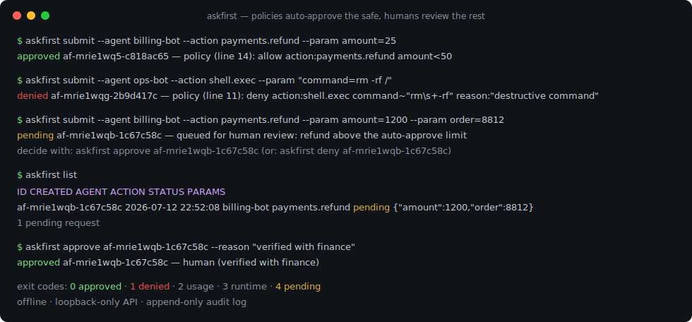
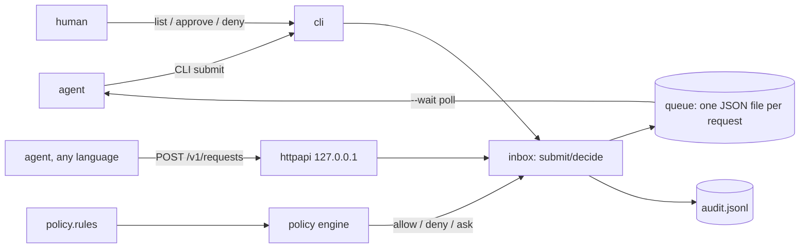

# askfirst

[English](README.md) | [中文](README.zh.md) | [日本語](README.ja.md)

[](LICENSE) [](go.mod) [](CHANGELOG.md)  [](CONTRIBUTING.md)

**askfirst：AI エージェントの行動を審査するオープンソースの承認キュー ― ポリシールールが安全なリクエストを自動承認し、残りはローカルの受信箱で人間がレビュー。すべての判断に監査ログが残る。**



```bash
git clone https://github.com/JaydenCJ/askfirst && cd askfirst
go build -o askfirst ./cmd/askfirst    # single static binary, stdlib only
```

> プレリリース：v0.1.0 はまだどのレジストリにも公開されていません。上記の通りソースからビルドしてください（Go ≥1.22 で可）。

## なぜ askfirst？

エンタープライズのエージェント導入は必ず同じ要件にぶつかる。*実行前に人間がノーと言えること*。既存の答えはどれも、この安全装置を別の何かに縛り付けている。フレームワークの割り込みフック（LangGraph 型）は、そのフレームワーク・その言語で書かれたエージェントしか守れず、保留状態はグラフの checkpoint の中に埋まって `ls` でも見えない。承認 SaaS（HumanLayer 型）はエージェントがやろうとする行動を他社のクラウドに通し、全ツールにベンダー SDK を差し込む。手作りの Slack 通知にはポリシー層がなく、全行動が人を中断するか、誰かがボットの権限を緩め続けて何も止まらなくなるかのどちらかだ。askfirst はそれらの下に欠けていたプリミティブ：スタンドアロンでローカル、小さなルール言語を備えた承認キューである。エージェントは CLI かループバック HTTP API で `action + params` を提出する。ルールが定型作業を自動承認し（`amount<50`、`agent:ci-* env=staging`）、禁止事項を自動拒否し（`command~"rm\s+-rf"`）、残りはすべて人間待ちの列へ ― 応答には判断を下したルールがそのまま引用され、誰がいつ何をなぜ承認したかは追記専用の監査ログに残る。

| | askfirst | フレームワーク割り込みフック | 承認 SaaS | 手作り Slack 通知 |
|---|---|---|---|---|
| 任意のフレームワーク / 言語で使える | ✅ CLI 終了コード + HTTP | ❌ 単一フレームワーク限定 | ✅ ベンダー SDK 経由 | ✅ |
| ルールによる自動承認（閾値・glob・正規表現） | ✅ | ❌ ゲートごとにコード | 一部、プラン次第 | ❌ |
| どのルールが決めたか行単位で引用 | ✅ | ❌ | ❌ | ❌ |
| 追記専用のローカル監査ログ | ✅ | ❌ checkpoint 内部 | クラウド側 | チャットに散在 |
| 完全オフライン、データは端末から出ない | ✅ | ✅ | ❌ SaaS | ❌ |
| ランタイム依存 | 0 | フレームワーク全体 | SDK + クラウド | webhook の糊 |

<sub>依存数は 2026-07-12 に確認：askfirst は Go 標準ライブラリのみを import。典型的な承認 SDK は HTTP クライアント・リトライ・認証の依存ツリーを全エージェントプロセスに持ち込む。</sub>

## 特長

- **コールバックではなくポリシールール** ― 5 分で覚えるルール言語（`allow` / `deny` / `ask` + glob・正規表現・数値閾値・ドット区切りパス）がツールごとの承認コードを置き換える。最初に一致した行が勝ち、`default ask` でフェイルオープンしない。
- **エージェントがそのまま使える終了コード** ― `submit` は 0 承認・1 拒否・4 保留を返すので、シェルラッパーは `if` 一つで任意のコマンドに関所を置ける。`--wait` は人の判断まで待機、`--ttl` で古いリクエストは失効。
- **人間のための本物の受信箱** ― `list`、`show`、`approve <id> --reason`、`deny <id>`。保留中のリクエストはただの JSON ファイルで、読めて、grep できて、バックアップできる。
- **すべての判断に説明が付く** ― 自動判断は発火したポリシー行をそのまま引用。人の判断は誰が・いつ・どんな理由かを追記専用の `audit.jsonl` に記録する。
- **ループバック HTTP API** ― `askfirst serve` が 127.0.0.1 で提出/ポーリング/承認を提供し、どの言語からも接続できる。bearer トークンなしでの非ループバック待受は拒否する。
- **フェイルクローズドな評価** ― パラメータ欠落・数値風文字列・複合値はマッチャーを満たさない。曖昧なものは人間レビューに落ち、自動承認には決して落ちない。
- **依存ゼロ・完全オフライン** ― Go 標準ライブラリのみ。テレメトリなし、ネットワーク呼び出しなし、データは端末の外に出ない。

## クイックスタート

```bash
askfirst init            # creates ~/.askfirst with a starter policy
askfirst submit --agent billing-bot --action payments.refund --param amount=25
```

実際にキャプチャした出力 ― 少額の返金は `amount<50` に一致し即承認（終了コード 0）：

```text
approved af-mrie1wq5-c818ac65 — policy (line 14): allow action:payments.refund amount<50
```

高額の返金（`--param amount=1200 --param order=8812`）は `ask` ルールに落ち、レビュー待ちの列へ（終了コード 4）：

```text
pending af-mrie1wqb-1c67c58c — queued for human review: refund above the auto-approve limit
decide with: askfirst approve af-mrie1wqb-1c67c58c   (or: askfirst deny af-mrie1wqb-1c67c58c)
```

人間側は受信箱（`askfirst list`、実出力）：

```text
ID                    CREATED              AGENT        ACTION           STATUS   PARAMS
af-mrie1wqb-1c67c58c  2026-07-12 22:52:08  billing-bot  payments.refund  pending  {"amount":1200,"order":8812}
1 pending request

$ askfirst approve af-mrie1wqb-1c67c58c --reason "verified with finance"
approved af-mrie1wqb-1c67c58c — human (verified with finance)
```

実コマンドに関所を置くなら同梱ラッパーを：`bash examples/agent-wrapper.sh <dir> git push origin main` がコマンドラインを提出し、判断を待ち、承認時のみ実行する。

## ポリシールール

1 行 1 ルール、最初の一致が勝ち、`default ask` が残りを受け止める ― 完全なリファレンスは [docs/policy.md](docs/policy.md)、より豊富な例は [examples/policy.rules](examples/policy.rules)。

| マッチャー | 例 | 意味 |
|---|---|---|
| `action:<glob>` | `action:payments.*` | アクション名への glob（`*`、`?`） |
| `agent:<glob>` | `agent:ci-*` | 提出エージェントへの glob |
| `key=value` / `key!=value` | `mode=readonly` | スカラー等値比較；`!=` はキーの存在が必須 |
| `key~regex` | `command~"rm\s+-rf"` | 値のテキストへの非アンカー RE2 検索 |
| `key<n` / `key>n` | `amount<50` | 数値比較 ― JSON 数値のみ、文字列は決して一致しない |
| `reason:"…"` | `reason:"needs sign-off"` | 注釈。エージェント・レビュアー・監査ログに表示 |

`askfirst policy check` はファイルを検証。`askfirst policy test --action … --param …` はキューに触れず判断をドライランし、一致した行を表示する。

## CLI と終了コード

`askfirst [--dir DIR] <command>` ― 受信箱ディレクトリは `$ASKFIRST_DIR`、なければ `~/.askfirst`。

| コマンド | 効果 |
|---|---|
| `init` | 受信箱とスターターポリシーを作成（編集済みポリシーは上書きしない） |
| `submit --action … [--param k=v]… [--ttl 5m] [--wait]` | 評価して承認/拒否/キュー投入；機械向けには `--format json` |
| `list [--status pending\|approved\|denied\|expired\|all]` | 受信箱を表示 |
| `show <id>` / `approve <id> [--reason …]` / `deny <id>` | 確認と裁定 |
| `log` | 追記専用の監査証跡（SIEM 取り込みには `--format json`） |
| `policy check` / `policy test` | ポリシーの検証 / ドライラン |
| `serve [--addr 127.0.0.1:2750] [--token T]` | ローカル HTTP API |

終了コード：**0** 承認 · **1** 拒否 · **2** 使用法エラー · **3** 実行時エラー · **4** 保留・タイムアウト・失効。

## HTTP API

`askfirst serve` は既定で 127.0.0.1 に bind し、素の JSON だけを話す。HTTP クライアントさえあればどの言語からも繋がる：

| ルート | 効果 |
|---|---|
| `POST /v1/requests` `{agent, action, params, ttl_seconds}` | 評価；自動判断は 200、保留は 202 |
| `GET /v1/requests/{id}[?wait=30s]` | 単一リクエストのポーリング（またはロングポーリング） |
| `GET /v1/requests?status=pending` | 受信箱 |
| `POST /v1/requests/{id}/approve` \| `/deny` `{reason}` | 人間の裁定；裁定済み・失効は 409 |
| `GET /v1/policy` · `GET /healthz` | 読み込み済みルール · 死活監視 |

## 検証

このリポジトリは CI を持たない。上記の主張はすべてローカル実行で検証される：

```bash
go test ./...            # 90 deterministic tests, offline, < 5 s
bash scripts/smoke.sh    # end-to-end CLI + HTTP check, prints SMOKE OK
```

## アーキテクチャ



## ロードマップ

- [x] v0.1.0 ― ルール言語（glob・正規表現・閾値・ドット区切りパス・フェイルクローズド）、TTL 失効付きファイルキュー、終了コード契約の CLI 受信箱、`--wait` ブロッキング提出、bearer トークン付きループバック HTTP API、追記専用監査ログ、90 テスト + スモークスクリプト
- [ ] `askfirst watch` ― キーボードで承認/拒否できるライブ端末受信箱
- [ ] 通知フック：リクエストがキューに入ったらユーザー指定コマンドを実行
- [ ] ルール単位のレート制限（`allow … max:10/hour`）と複数人承認
- [ ] 同じバイナリから配信する Web 受信箱
- [ ] エージェントが自分のキューを改竄できないようにするリクエスト署名

全リストは [open issues](https://github.com/JaydenCJ/askfirst/issues) を参照。

## コントリビュート

Issue・議論・PR を歓迎 ― ローカルの作業手順（フォーマット、vet、テスト、`SMOKE OK`）は [CONTRIBUTING.md](CONTRIBUTING.md) を参照。入門タスクは [good first issue](https://github.com/JaydenCJ/askfirst/issues?q=is%3Aissue+is%3Aopen+label%3A%22good+first+issue%22)、設計の議論は [Discussions](https://github.com/JaydenCJ/askfirst/discussions) へ。

## ライセンス

[MIT](LICENSE)
