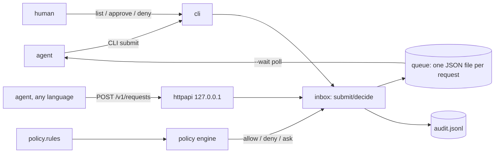

# askfirst

[English](README.md) | [中文](README.zh.md) | [日本語](README.ja.md)

[](LICENSE) [](go.mod) [](CHANGELOG.md)  [](CONTRIBUTING.md)

**askfirst：an open-source approval queue for AI agent actions — policy rules auto-approve the safe requests, humans review the rest in a local inbox, and every decision is audited.**


```bash
git clone https://github.com/JaydenCJ/askfirst && cd askfirst
go build -o askfirst ./cmd/askfirst    # single static binary, stdlib only
```

> Pre-release: v0.1.0 is not tagged on a package registry yet; build from source as above (any Go ≥1.22).

## Why askfirst?

Every enterprise agent deployment hits the same requirement: *a human must be able to say no before the action happens*. The existing answers all couple that safeguard to something else. Framework interrupt hooks (LangGraph-style) only guard agents written in that framework, in that language, and the pending state lives inside a graph checkpoint you cannot inspect with `ls`. Approval SaaS (HumanLayer-style) routes your agents' intended actions through someone else's cloud and adds a vendor SDK to every tool. A hand-rolled Slack ping has no policy layer, so either every action interrupts a person or someone widens the bot's permissions until nothing does. askfirst is the missing primitive underneath all of these: a standalone, local approval queue with a small rule language. Agents submit `action + params` over the CLI or a loopback HTTP API; rules auto-approve the routine (`amount<50`, `agent:ci-* env=staging`), auto-deny the forbidden (`command~"rm\s+-rf"`), and queue everything else for a human — with the deciding rule quoted in the answer and an append-only audit log of who approved what, when, and why.

| | askfirst | framework interrupt hooks | approval SaaS | hand-rolled Slack ping |
|---|---|---|---|---|
| Works with any agent framework / language | ✅ CLI exit codes + HTTP | ❌ one framework | ✅ via vendor SDK | ✅ |
| Rule-based auto-approval (thresholds, globs, regex) | ✅ | ❌ code per gate | partial, per-plan | ❌ |
| Explains which rule decided, line-quoted | ✅ | ❌ | ❌ | ❌ |
| Append-only local audit log | ✅ | ❌ checkpoint internals | cloud-side | scattered in chat |
| Works fully offline, data stays on the machine | ✅ | ✅ | ❌ SaaS | ❌ |
| Runtime dependencies | 0 | the framework | SDK + cloud | webhook glue |

<sub>Dependency count checked 2026-07-12: askfirst imports the Go standard library only; typical approval SDKs pull an HTTP client, retry, and auth dependency tree into every agent process.</sub>

## Features

- **Policy rules, not callbacks** — a five-minute rule language (`allow` / `deny` / `ask` + globs, regex, numeric thresholds, dotted param paths) replaces per-tool approval code; first match wins, and `default ask` means nothing fails open.
- **Exit codes agents can act on** — `submit` returns 0 approved, 1 denied, 4 pending, so a shell wrapper gates any command with a plain `if`; `--wait` blocks until a human decides, `--ttl` expires stale requests.
- **A real inbox for humans** — `list`, `show`, `approve <id> --reason`, `deny <id>`: pending requests are plain JSON files you can read, grep, and back up.
- **Every decision explained** — auto-decisions quote the exact policy line that fired; human decisions record who, when, and the reason, in an append-only `audit.jsonl`.
- **Loopback HTTP API** — `askfirst serve` exposes submit/poll/approve on 127.0.0.1 for agents in any language; non-loopback binds are refused unless a bearer token is set.
- **Fail-closed evaluation** — missing params, numeric strings, and composite values never satisfy a matcher; ambiguity falls through to human review, never to auto-approval.
- **Zero dependencies, fully offline** — Go standard library only; no telemetry, no network calls, nothing leaves the machine.

## Quickstart

```bash
askfirst init            # creates ~/.askfirst with a starter policy
askfirst submit --agent billing-bot --action payments.refund --param amount=25
```

Real captured output — the small refund matches `amount<50` and is approved instantly (exit 0):

```text
approved af-mrie1wq5-c818ac65 — policy (line 14): allow action:payments.refund amount<50
```

A large refund (`--param amount=1200 --param order=8812`) falls through to the `ask` rule and queues for review (exit 4):

```text
pending af-mrie1wqb-1c67c58c — queued for human review: refund above the auto-approve limit
decide with: askfirst approve af-mrie1wqb-1c67c58c   (or: askfirst deny af-mrie1wqb-1c67c58c)
```

The human side is an inbox (`askfirst list`, real output):

```text
ID                    CREATED              AGENT        ACTION           STATUS   PARAMS
af-mrie1wqb-1c67c58c  2026-07-12 22:52:08  billing-bot  payments.refund  pending  {"amount":1200,"order":8812}
1 pending request

$ askfirst approve af-mrie1wqb-1c67c58c --reason "verified with finance"
approved af-mrie1wqb-1c67c58c — human (verified with finance)
```

To guard a real command, use the bundled wrapper: `bash examples/agent-wrapper.sh <dir> git push origin main` submits the command line, waits for a decision, and only executes on approval.

## Policy rules

One rule per line, first match wins, `default ask` catches the rest — full reference in [docs/policy.md](docs/policy.md), richer example in [examples/policy.rules](examples/policy.rules).

| Matcher | Example | Meaning |
|---|---|---|
| `action:<glob>` | `action:payments.*` | glob on the action name (`*`, `?`) |
| `agent:<glob>` | `agent:ci-*` | glob on the submitting agent |
| `key=value` / `key!=value` | `mode=readonly` | scalar equality; `!=` requires the key to be present |
| `key~regex` | `command~"rm\s+-rf"` | unanchored RE2 search on the value as text |
| `key<n` / `key>n` | `amount<50` | numeric comparison — JSON numbers only, strings never match |
| `reason:"…"` | `reason:"needs sign-off"` | annotation shown to the agent, the reviewer, and the audit log |

`askfirst policy check` validates the file; `askfirst policy test --action … --param …` dry-runs a decision and prints the matching line without touching the queue.

## CLI and exit codes

`askfirst [--dir DIR] <command>` — the inbox directory defaults to `$ASKFIRST_DIR`, then `~/.askfirst`.

| Command | Effect |
|---|---|
| `init` | create the inbox and a starter policy (never overwrites an edited one) |
| `submit --action … [--param k=v]… [--ttl 5m] [--wait]` | evaluate, then approve/deny/queue; `--format json` for machines |
| `list [--status pending\|approved\|denied\|expired\|all]` | show the inbox |
| `show <id>` / `approve <id> [--reason …]` / `deny <id>` | inspect and decide |
| `log` | append-only audit trail (`--format json` for SIEM ingestion) |
| `policy check` / `policy test` | validate / dry-run the policy |
| `serve [--addr 127.0.0.1:2750] [--token T]` | local HTTP API |

Exit codes: **0** approved · **1** denied · **2** usage error · **3** runtime error · **4** pending, timed out, or expired.

## HTTP API

`askfirst serve` binds 127.0.0.1 by default and speaks plain JSON, so any language integrates with an HTTP client and nothing else:

| Route | Effect |
|---|---|
| `POST /v1/requests` `{agent, action, params, ttl_seconds}` | evaluate; 200 with the auto-decision, or 202 pending |
| `GET /v1/requests/{id}[?wait=30s]` | poll (or long-poll) one request |
| `GET /v1/requests?status=pending` | the inbox |
| `POST /v1/requests/{id}/approve` \| `/deny` `{reason}` | human decision; 409 if already decided or expired |
| `GET /v1/policy` · `GET /healthz` | loaded rules · liveness |

## Verification

This repository ships no CI; every claim above is verified by local runs:

```bash
go test ./...            # 90 deterministic tests, offline, < 5 s
bash scripts/smoke.sh    # end-to-end CLI + HTTP check, prints SMOKE OK
```

## Architecture



## Roadmap

- [x] v0.1.0 — rule language (globs, regex, thresholds, dotted paths, fail-closed), file-backed queue with TTL expiry, CLI inbox with exit-code contract, `--wait` blocking submits, loopback HTTP API with bearer token, append-only audit log, 90 tests + smoke script
- [ ] `askfirst watch` — live terminal inbox with keyboard approve/deny
- [ ] Notification hooks: run a user-supplied command when a request queues
- [ ] Per-rule rate limits (`allow … max:10/hour`) and approval quorums
- [ ] Web inbox served from the same binary
- [ ] Request signing so agents cannot tamper with their own queue files

See the [open issues](https://github.com/JaydenCJ/askfirst/issues) for the full list.

## Contributing

Issues, discussions and pull requests are welcome — see [CONTRIBUTING.md](CONTRIBUTING.md) for the local workflow (format, vet, tests, `SMOKE OK`). Good entry points are labelled [good first issue](https://github.com/JaydenCJ/askfirst/issues?q=is%3Aissue+is%3Aopen+label%3A%22good+first+issue%22), and design questions live in [Discussions](https://github.com/JaydenCJ/askfirst/discussions).

## License

[MIT](LICENSE)
