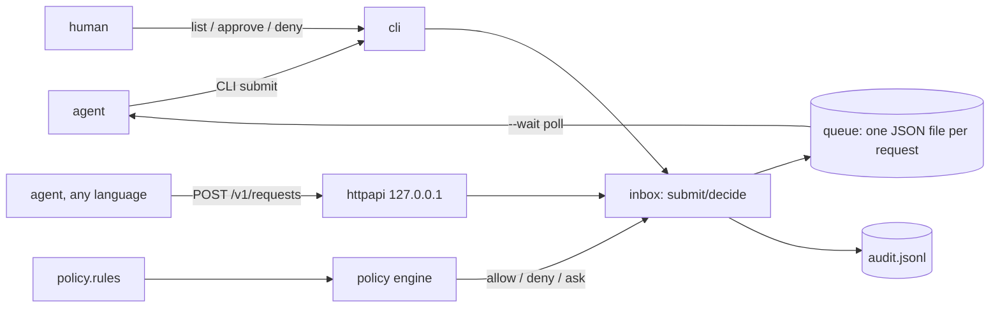

# askfirst

[English](README.md) | [中文](README.zh.md) | [日本語](README.ja.md)

[](LICENSE) [](go.mod) [](CHANGELOG.md)  [](CONTRIBUTING.md)

**askfirst：开源的 AI agent 行为审批队列 —— 策略规则自动放行安全请求，其余进入本地收件箱由人来审，每个决定都留审计记录。**


```bash
git clone https://github.com/JaydenCJ/askfirst && cd askfirst
go build -o askfirst ./cmd/askfirst    # single static binary, stdlib only
```

> 预发布：v0.1.0 尚未发布到任何软件仓库；请按上述方式从源码构建（Go ≥1.22 即可）。

## 为什么要 askfirst？

每个企业级 agent 部署都会撞上同一条硬性要求：*动作执行之前，必须有人能说不*。现有方案都把这道保险和别的东西绑在一起。框架的中断钩子（LangGraph 式）只能保护用该框架、该语言写的 agent，待审状态埋在图 checkpoint 里，`ls` 都看不见。审批 SaaS（HumanLayer 式）把你的 agent 想做的事路由到别人的云上，还给每个工具塞一个厂商 SDK。手搓的 Slack 通知没有策略层，结果要么每个动作都打断一个人，要么有人不断放宽机器人权限直到什么都拦不住。askfirst 是这一切底下缺失的那块原语：一个独立、本地、带小型规则语言的审批队列。agent 通过 CLI 或回环 HTTP API 提交 `action + params`；规则自动放行例行操作（`amount<50`、`agent:ci-* env=staging`），自动拒绝禁区（`command~"rm\s+-rf"`），其余全部排队等人 —— 应答里会引用做出决定的那条规则，并有一份只追加的审计日志记录谁在何时因何批准了什么。

| | askfirst | 框架中断钩子 | 审批 SaaS | 手搓 Slack 通知 |
|---|---|---|---|---|
| 兼容任意 agent 框架 / 语言 | ✅ CLI 退出码 + HTTP | ❌ 绑定单一框架 | ✅ 需厂商 SDK | ✅ |
| 规则化自动审批（阈值、glob、正则） | ✅ | ❌ 每个关卡写代码 | 部分，按套餐 | ❌ |
| 说明是哪条规则拍板，引用到行 | ✅ | ❌ | ❌ | ❌ |
| 只追加的本地审计日志 | ✅ | ❌ checkpoint 内部 | 存在云端 | 散落在聊天里 |
| 完全离线，数据不出本机 | ✅ | ✅ | ❌ SaaS | ❌ |
| 运行时依赖 | 0 | 整个框架 | SDK + 云 | webhook 胶水 |

<sub>依赖数核对于 2026-07-12：askfirst 只导入 Go 标准库；典型审批 SDK 会把 HTTP 客户端、重试、鉴权整棵依赖树拖进每个 agent 进程。</sub>

## 特性

- **策略规则，而非回调** —— 五分钟上手的规则语言（`allow` / `deny` / `ask` + glob、正则、数值阈值、点号参数路径）取代逐工具的审批代码；首条命中即生效，`default ask` 保证不会失败开放。
- **agent 能直接消费的退出码** —— `submit` 返回 0 批准、1 拒绝、4 待审，一个 shell 包装用一句 `if` 就能给任意命令上闸；`--wait` 阻塞到有人拍板，`--ttl` 让过期请求自动失效。
- **给人用的真收件箱** —— `list`、`show`、`approve <id> --reason`、`deny <id>`：待审请求就是普通 JSON 文件，可读、可 grep、可备份。
- **每个决定都有解释** —— 自动决定会引用触发的那一行策略；人工决定记录谁、何时、什么理由，写入只追加的 `audit.jsonl`。
- **回环 HTTP API** —— `askfirst serve` 在 127.0.0.1 上提供提交/轮询/批准接口，任何语言都能接入；不设 bearer token 就拒绝绑定非回环地址。
- **失败即收紧的求值** —— 缺失参数、数字字符串、复合值一律不满足匹配器；含糊情形只会落到人工审核，绝不会落到自动放行。
- **零依赖、完全离线** —— 只用 Go 标准库；没有遥测，没有网络调用，任何数据不出本机。

## 快速上手

```bash
askfirst init            # creates ~/.askfirst with a starter policy
askfirst submit --agent billing-bot --action payments.refund --param amount=25
```

真实抓取的输出 —— 小额退款命中 `amount<50`，立即批准（退出码 0）：

```text
approved af-mrie1wq5-c818ac65 — policy (line 14): allow action:payments.refund amount<50
```

大额退款（`--param amount=1200 --param order=8812`）落入 `ask` 规则，排队等人审（退出码 4）：

```text
pending af-mrie1wqb-1c67c58c — queued for human review: refund above the auto-approve limit
decide with: askfirst approve af-mrie1wqb-1c67c58c   (or: askfirst deny af-mrie1wqb-1c67c58c)
```

人这一侧是个收件箱（`askfirst list`，真实输出）：

```text
ID                    CREATED              AGENT        ACTION           STATUS   PARAMS
af-mrie1wqb-1c67c58c  2026-07-12 22:52:08  billing-bot  payments.refund  pending  {"amount":1200,"order":8812}
1 pending request

$ askfirst approve af-mrie1wqb-1c67c58c --reason "verified with finance"
approved af-mrie1wqb-1c67c58c — human (verified with finance)
```

想给真实命令上闸，用自带的包装脚本：`bash examples/agent-wrapper.sh <dir> git push origin main` 会提交这条命令行，等待裁决，批准后才执行。

## 策略规则

一行一条规则，首条命中即生效，`default ask` 兜底 —— 完整参考见 [docs/policy.md](docs/policy.md)，更丰富的示例见 [examples/policy.rules](examples/policy.rules)。

| 匹配器 | 示例 | 含义 |
|---|---|---|
| `action:<glob>` | `action:payments.*` | 对 action 名做 glob 匹配（`*`、`?`） |
| `agent:<glob>` | `agent:ci-*` | 对提交 agent 做 glob 匹配 |
| `key=value` / `key!=value` | `mode=readonly` | 标量相等；`!=` 要求键必须存在 |
| `key~regex` | `command~"rm\s+-rf"` | 对值的文本做不锚定的 RE2 搜索 |
| `key<n` / `key>n` | `amount<50` | 数值比较 —— 仅限 JSON 数字，字符串永不匹配 |
| `reason:"…"` | `reason:"needs sign-off"` | 注释，展示给 agent、审核人和审计日志 |

`askfirst policy check` 校验策略文件；`askfirst policy test --action … --param …` 干跑一次决策并打印命中的那一行，不碰队列。

## CLI 与退出码

`askfirst [--dir DIR] <command>` —— 收件箱目录默认取 `$ASKFIRST_DIR`，其次 `~/.askfirst`。

| 命令 | 作用 |
|---|---|
| `init` | 创建收件箱和入门策略（绝不覆盖已编辑的策略） |
| `submit --action … [--param k=v]… [--ttl 5m] [--wait]` | 求值后批准/拒绝/排队；`--format json` 供程序消费 |
| `list [--status pending\|approved\|denied\|expired\|all]` | 查看收件箱 |
| `show <id>` / `approve <id> [--reason …]` / `deny <id>` | 查看与裁决 |
| `log` | 只追加的审计轨迹（`--format json` 便于 SIEM 摄取） |
| `policy check` / `policy test` | 校验 / 干跑策略 |
| `serve [--addr 127.0.0.1:2750] [--token T]` | 本地 HTTP API |

退出码：**0** 批准 · **1** 拒绝 · **2** 用法错误 · **3** 运行时错误 · **4** 待审、超时或已过期。

## HTTP API

`askfirst serve` 默认绑定 127.0.0.1，只说纯 JSON，任何语言有个 HTTP 客户端就能接：

| 路由 | 作用 |
|---|---|
| `POST /v1/requests` `{agent, action, params, ttl_seconds}` | 求值；自动决定返回 200，待审返回 202 |
| `GET /v1/requests/{id}[?wait=30s]` | 轮询（或长轮询）单个请求 |
| `GET /v1/requests?status=pending` | 收件箱 |
| `POST /v1/requests/{id}/approve` \| `/deny` `{reason}` | 人工裁决；已裁决或已过期返回 409 |
| `GET /v1/policy` · `GET /healthz` | 已加载规则 · 存活探针 |

## 验证

本仓库不带 CI；上述每一条主张都由本地运行验证：

```bash
go test ./...            # 90 deterministic tests, offline, < 5 s
bash scripts/smoke.sh    # end-to-end CLI + HTTP check, prints SMOKE OK
```

## 架构



## 路线图

- [x] v0.1.0 —— 规则语言（glob、正则、阈值、点号路径、失败即收紧）、带 TTL 过期的文件队列、退出码契约的 CLI 收件箱、`--wait` 阻塞提交、带 bearer token 的回环 HTTP API、只追加审计日志、90 个测试 + 冒烟脚本
- [ ] `askfirst watch` —— 终端实时收件箱，键盘批准/拒绝
- [ ] 通知钩子：请求排队时执行用户指定的命令
- [ ] 按规则限流（`allow … max:10/hour`）与多人会签
- [ ] 同一个二进制内置 Web 收件箱
- [ ] 请求签名，防止 agent 篡改自己的队列文件

完整列表见 [open issues](https://github.com/JaydenCJ/askfirst/issues)。

## 参与贡献

欢迎 issue、讨论与 PR —— 本地工作流（格式化、vet、测试、`SMOKE OK`）见 [CONTRIBUTING.md](CONTRIBUTING.md)。入门任务标注为 [good first issue](https://github.com/JaydenCJ/askfirst/issues?q=is%3Aissue+is%3Aopen+label%3A%22good+first+issue%22)，设计讨论在 [Discussions](https://github.com/JaydenCJ/askfirst/discussions)。

## 许可证

[MIT](LICENSE)
